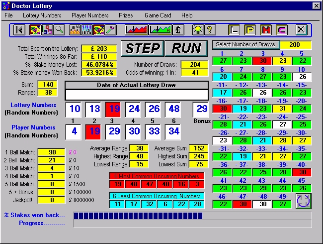



## Doctor Lottery: Complete Lottery Number Analyser and Simulator

### Description

Distributed as a commercial program, largely via computer magazine cover-mounted CD-ROMs and shareware downoad sites, This program will identify which lottery number formulae will work best in terms of highest return. A Must for any Lottery Player!. It calculates how much money you will lose! for arithmetic speed reasons, the engine for this program is in Microsoft Visual C++ and I have posted it in Planet's VC++ section. The program will run in any 32bit Visual Basic. This code demonstrates pretty much any VB app would be expected to do. Many users described this as CuriosityWare - Enjoy!
 
### More Info
 

             |
---                |---
**Submitted On**   |2000-11-09 01:25:52
**By**             |[Jason Bennison](https://github.com/Planet-Source-Code/PSCIndex/blob/master/ByAuthor/jason-bennison.md)
**Level**          |Advanced
**User Rating**    |5.0 (30 globes from 6 users)
**Compatibility**  |VB 4\.0 \(32\-bit\), VB 5\.0, VB 6\.0
**Category**       |[Complete Applications](https://github.com/Planet-Source-Code/PSCIndex/blob/master/ByCategory/complete-applications__1-27.md)
**World**          |[Visual Basic](https://github.com/Planet-Source-Code/PSCIndex/blob/master/ByWorld/visual-basic.md)
**Archive File**   |[CODE\_UPLOAD114921182000\.zip](https://github.com/Planet-Source-Code/jason-bennison-doctor-lottery-complete-lottery-number-analyser-and-simulator__1-12656/archive/master.zip)

